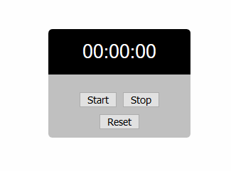

    Copyright(c) 2020-
    Author: Chaitanya Tejaswi(github.com / CRTejaswi)    License: GPL v3.0+

# Day 1 - English Dictionary
An English Dictionary utility. (Based on a project by [Ardit Sulce](https: // www.udemy.com / course / the - python - mega - course /))

<center>
    
</center>

<details>
<summary> v1 </summary>

> ...

```py
#!/usr/bin/env python3
import json
import sys

data = json.load(open('resources/dictionary.json'))


class Dictionary:
    '''
    Base class to lookup dictionary meanings of words.
    '''

    def meaning(self, word):
        word = word.lower()
        if word in data:
            print(f'>> {word}:', data[word])
        return None


if __name__ == '__main__':
    wordLookup = Dictionary()
    _, *words = sys.argv
    for word in words:
        wordLookup.meaning(word)
```

</details>
